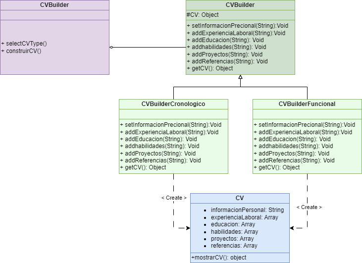

# README - Aplicación de Gestión de Currículos (CV)

## Descripción del Proyecto

Esta aplicación está diseñada para gestionar currículos de forma eficiente, permitiendo a los usuarios crear, editar y almacenar sus currículos en un formato organizado. La aplicación está dirigida tanto a buscadores de empleo como a reclutadores, proporcionando herramientas que facilitan la creación de CVs atractivos y la revisión de perfiles de candidatos.

## Características Principales

- **Creación de Currículos**: Permite a los usuarios crear y personalizar sus currículos utilizando plantillas predefinidas.
- **Interfaz Intuitiva**: Proporciona una experiencia de usuario amigable para facilitar la navegación y la edición de información.

## Patrones de Diseño Utilizados

### Patrón Builder

El patrón Builder se ha implementado en esta aplicación para facilitar la construcción de objetos complejos, en este caso, los currículos. Este patrón permite separar la creación de un objeto de su representación, lo que resulta en una estructura más flexible y mantenible.

#### Funcionamiento del Patrón Builder

1. **Clase Director**: Controla el proceso de construcción del currículo, utilizando el Builder para ensamblar diferentes partes del objeto(Archivo Generador.js).
2. **Interfaz Builder**: Define los métodos necesarios para construir cada sección del currículo, como experiencia laboral, educación, habilidades y contactos (Archivo CVBuidler.js).
3. **Clases Concretas del Builder**: Implementan la interfaz del Builder y proporcionan la lógica para construir las diferentes secciones del currículo, permitiendo al usuario añadir o modificar la información según sea necesario (Archivos CVBuilderCronologico.js y CVBuilderFuncional.js).
4. **Objeto Producto**: Representa el currículo final, que incluye todas las secciones y datos proporcionados por el usuario.

### Diagrama de Clases


## Interaactuar con la aplicacion

Si desea interactuar con la aplicacion puede hacerlo a travez de la pagina web desplegada en el siguiente link, tenga en cuenta que no existe una interfaz grafica como tal, el resultado se imprime por consola:
https://adep-123.github.io/implementacionPatronBuilder/

Por otro lado si desea copiar el repositorio puede realizarlo con el siguiente comando git en su ordenador, recuerde que debe tener instalado git:
```bash
- git clone https://github.com/ADEP-123/implementacionPatronBuilder.git
```
Posteriormente de copiar el repositorio puede abrir el archivo index.html desde local, o con un ambiente de desarrollo como visual studio code y una extension como LiveServer
